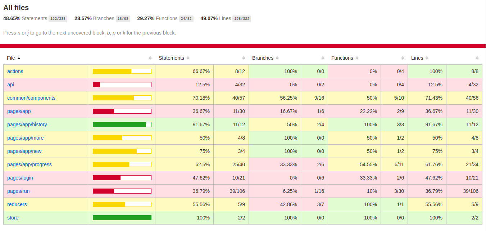
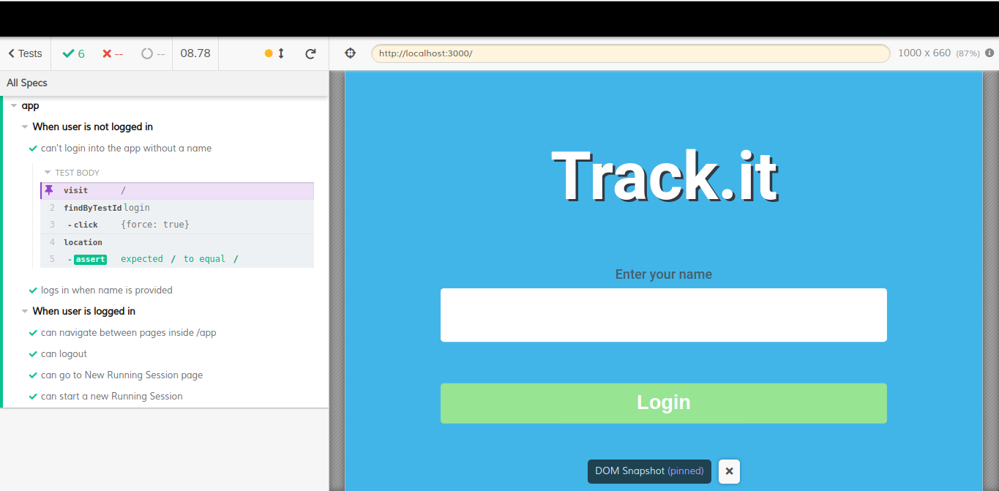

# Track.it

[]()
[]()
[]()

<br />
<p align="center">
  <a href="https://github.com/ldelbel/track.it">
    
  </a>

  <h3 align="center">Functional Running App for Mobile Devices<h3>
  <p align="center">
    <a href="https://github.com/ldelbel/track.it"><strong>Explore the docs »</strong></a>
    <br />
    <br />
    -
    <a href="https://github.com/ldelbel/track.it/issues">Report Bug</a>
    -
    <a href="https://github.com/ldelbel/track.it/pulls">Request Feature</a>
    -
  </p>
</p>
  
  
 <p align="center">
  
   
  
  
  
  
</p>
    
## Table of Contents

<p align="center">
  <a href="#brief">Project Briefing</a> |
  <a href="#require">Technical Requirements</a> |
  <a href="#arch">File Structure, Data Management and Quality Control</a> |
  <a href="#ldl">Live Demo Link</a> |
  <a href="#ins">Installing</a> |
  <a href="#with">Built With</a> |
  <a href="#author">Author</a>
</p>

## Project Briefing <a name = "brief"></a>

**--This is the front-end of a full stack project, to see the Rails API backend, check [here]()**

This project is the Final Capstone Project required for completing the Microverse Technical Curriculum [Microverse](https://www.microverse.org/).

The capstone project is performed under time restrictions and presents business-like specifications to be followed. The goal is to simulate as much as possible the real conditions of business situations and practice professional execution.

The specifications of this project can be found in the [Tracking App](https://www.notion.so/Final-Capstone-Project-Tracking-App-22e454da738c46efaf17721826841772).

## Technical Requirements <a name = "require"></a>

The original specification and design for the project followed those of [Gregoire Vella's on Behance 'Bodytrack.it'](https://www.behance.net/gallery/13271423/Bodytrackit-An-iOs-app-Branding-UX-and-UI). It was required to follow the design and we are supposed to change the theme of the project. I chose to make fully functional running app to challenge myself and for learning purposes.

The provided requirements stated that we must build the app following these guidelines:

- Connects to the back-end API to send and receive domain data
- With routes for each of the screens, so the user can easily go back and forward
- Using redux to store info used across the app, like the username

This project is a **Full Stack Project**, built in two parts. This repository contains the front-end, and this [link]() will lead you to the repository where the backend (a Rails API) is.

## File Structure, Data Management and Quality Control <a name = "arch"></a>

### File Structure

The structure used in this project was inspired on the [View-State Split Structure](https://www.pluralsight.com/guides/how-to-organize-your-react-+-redux-codebase) because it fulfills the needs of the project based on its size and complexity.

### State Management

The state of the entire app was managed using Redux Store.

### External Requests and API

The data is hadled by the Rails API built exclusively for this project, and hosted on Heroku. Check it [here](). 

### Quality Control

This project was built following the rules of [ESLint](https://eslint.org/) and [Stylelint](https://stylelint.io/).


## Live Demo Link <a name = "ldl"></a>

[Live Demo]()

If you want to check how the pages look already filled with data, login using the name "example".

## 🔧 Built with <a name = "with"></a>

- Javascript
- ReactJS with React Hooks
- Redux
- yarn
- SCSS Modules
- Tested with Jest, Enzyme & Cypress

## 🛠 Requirements <a name = "req"></a>

You'll need a package manager to install the dependencies listed in package.json in order to make it work in your local machine.
This project used YARN. The installation guide can be found [Here](https://classic.yarnpkg.com/en/docs/install/#debian-stable) (for Ubuntu).

## 🔨 Setup and Installing <a name = "ins"></a>

To setup the project, run the following commands on terminal:

```
$ cd <folder> (the place you want to have the files installed)
$ git clone https://github.com/ldelbel/track.it.git
$ cd track.it
$ yarn install

```

This will install the dependencies in your local machine. This process can take a few minutes.

## 🔨 Running Locally

After installing the dependencies you can start the application running the code below

```
$ yarn start

```

If your default browser doesn't open automatically, visit http://localhost/3000.

## 🔨 Testing

### Unit Tests

Unit tests were made using **Jest**, along with a few tools:

- **react-testing-library** and **enzyme** for DOM tests
- **react-test-renderer** for snapshots


To run the tests, use the command below

```
$ yarn test

```

#### Coverage

  This is a project with the goal of learning and presenting the skills acquired along the React&Redux section of Microverse Curriculum. Because of that, the coverage goals were not very high. It was decided that for this purpose maintaining overall coverage around 50% is acceptable.
  


### Integration Tests (E2E)

Cypress was used to make the integration tests for the main basic functionalities of the app.

To run the tests in your terminal and generate the video simulating the user navigation, run the following command:

```
$ yarn test:e2e

```
To watch the procedures of the test suites in Cypress interface, run the following command:

```
$ yarn test:e2e:dev

```



## ✒️ Author <a name = "author"></a>

### 👨‍💻 Lucas Delbel

[](https://github.com/ldelbel)
[](https://www.linkedin.com/in/lucasdelbel/)
[](mailto:lucdelbel@gmail.com)
[](https://twitter.com/delbel_lucas)

## 🤝 Contributing

Contributions, issues and feature requests are welcome!

Feel free to check the [issues page]().

## 👍 Show your support

Give a ⭐️ if you like this project!

## :clap: Acknowledgements

- Microverse: [@microverse](https://www.microverse.org/)
- React: [@react](https://reactjs.org/)
- Gregoire Vella's on Behance 'Bodytrack.it': [@bodytrack.it](https://www.behance.net/gallery/13271423/Bodytrackit-An-iOs-app-Branding-UX-and-UI)
